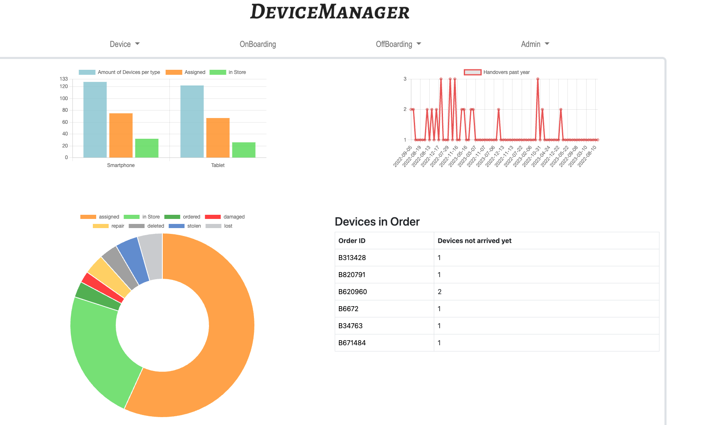
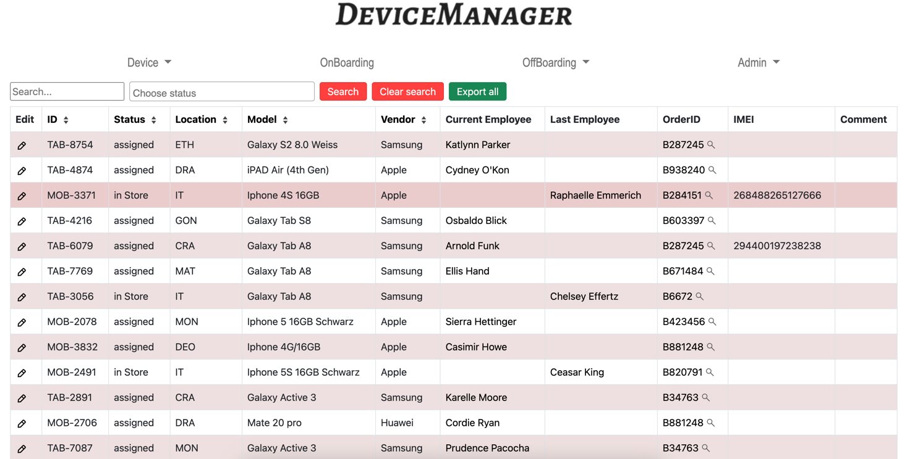
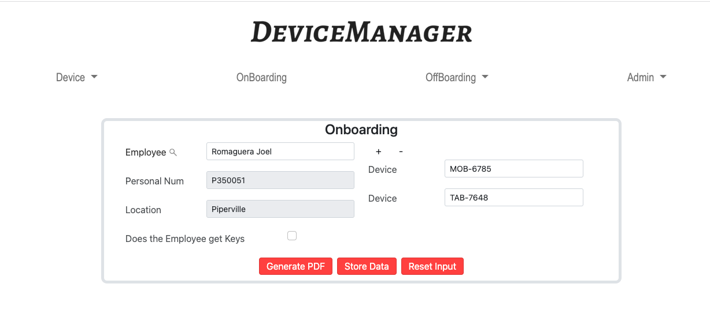
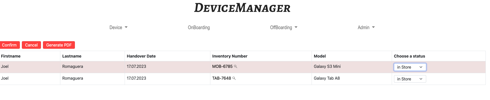

# DeviceManager

**Description**: 


This project was part of my diploma project which was created in cooperation with an IT department to behave their devices.


The webapplication should offer the possibility to administrate devices fast and easy. In addition, the handover and return process should be made quicker. Which is provided by an automatic filling of the forms.
Validation should minimize input errors and ensure correct data.

Another requirement was to provide quick actions for devices like when a device is broken, stolen or lost.


- **Technology stack**:   
  - Laravel 9(PHP 8)
  - Javascript
  - MySql
  - Bootstrap 5, HTML, CSS  

- **Libaries**:
  - fakerphp
  - fpdf/fpdi
  - Column sort(kyslik)
  - Chart.js
  - select2
  


**Screenshot**:


Dashboard


Device overview


Onboarding


Offboarding

## Installation

Requirements:

Docker


```
    git clone https://github.com/Thub543/DeviceManagerPriv.git
```

Then you need to compose the docker containers:

```
    docker-compose up -d
```

This will create a MySql container and a Webserver container with the Laravel Application. The database will be created automatically and will be seeded with fake data.

You can access the application on [localhost:80](http://localhost:80)

Login credentials:  
Admin:  
    Username: admin  
    Password: 1234

ReadOnly:  
    Username: ro  
    Password: 1234

## Usage

The centerpiece of the app are the devices. These can be created under Navigation bar Device->Add.

### Device add

Devices always belong to an order, either you extend an order or you create a new one, depending on what you choose 
you have to select an order date or it is automatically set to Order Date which Order is selected.
Warranty is always +2 years from the order date, but you can choose a date that counts for all devices that you order in one go.

Next you can choose a status, in store or ordered. As the names indicate, with "in Store" 
the device can be used immediately, with "ordered" the device must first be updated as arrived before it can be used.

Then you can select the type and the model, as soon as you select a type, only models of that type are displayed. 
Here there is still a distinction between "normal" devices and stationary devices. But this only has an influence on where the devices are displayed in the end and stationary devices can have a location and can not be assigned.

Finally, a location can be chosen, usually in store or ordered IT is taken.

The Inventory id will be  autogenerated. It will take the Type intials and the next free number.

### Employee

Employees can be added individually via the add form or via excl file.
These Excel files must have specific column names and order. 
It is best to export the first time to have a correct file. Then you can enter employees, personnel numbers are not required 
fields but must be unique, as location the location initials are entered.

Also, as already mentioned, the employees can be exported to an Excel file.

### Location

Locations manage the locations of the company, where the employees are located, a location has a name and a shortened name, which must be unique.

### Devicemodels / Types

Devicemodel and types are the types of devices and the respective models.
For types there is a separation between normal and stationary. That means stationary devices are e.g. printers. 
These are under the menu item Device>Stationary and normal are under Device>Overview furthermore Stationary can not be assigned
to an Employee it will only update the location.

### Onboarding

Onboarding is the assignment of device and employee. After three characters it will search the Employee Table and display 
the results in a dropdown field, then it will display the Location field and if available the Personnel number for information purposes. 
Then you can search and select devices, also here after three characters a dropdown field will appear, then only available devices will be 
displayed. You can assign up to 10 devices at once. When you are done you can create an onboarding form and then click Store Data to save the data.


### Offboarding
Offboarding is the case when the employee returns the devices. Under the Offboarding>Return devices page you can see active handovers, you can select the handovers but only from the same employee. After the selection click start offboarding and you can select a new status for the device and generate the offboarding form.

If the new status offboarding is selected, the handover will not be completed immediately, so the handover will be moved to the pending view, which is used to prepare handovers.****

## Configuration


It is also possible to use other databases. But this must be changed in the .env.  
But you have to consider which database is [supported by laravel](https://laravel.com/docs/9.x/database#introduction).

In this regard, the Docker container must also be revised in the docker-compose.yaml file.

If you don't want to use a Docker environment, there is the possibility to start a dev server locally with laravel.
Navigate to the www folder and run ``php artisan serve`` to start the server(but you still need a DB).

To migrate and seed the database run the command ``php artisan migrate:fresh``.

if you also want to seed at the same time append a --seed ``` php artisan migrate:fresh --seed``` 


**.env**
```

DB_CONNECTION=mysql
DB_HOST=127.0.0.1
DB_PORT=3306
DB_DATABASE=DeviceManager
DB_USERNAME=root
DB_PASSWORD=MySqlServer2023
```

----

## Credits and references

The fronted was made by a project colleague.
